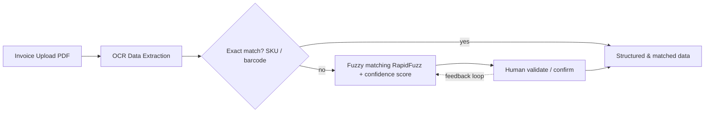

# EGM Automated Data Management System — Internship

**Type:** Internship, GRCG (Global Remote Consulting Group), client: EGM (supermarket chain)
**Role:** I owned the UML database schema design, data extraction, and validation/comparison logic. A
separate team workstream (product categorisation — reclassifying ~8,000 products) was owned by teammates.

> ⚠️ **No code in this folder.** This was client engagement work on real, confidential supplier data —
> the code and client materials aren't mine to publish. This README describes the system I built; the full
> narrative is in the linked case study.

## Problem

EGM's supplier invoices arrived as unstructured PDFs from multiple suppliers, and matching invoice line
items against the existing product database was a manual, slow, error-prone process. The brief: design and
build an automated pipeline from "invoice lands in the system" to "validated, matched, structured data."

## Approach

1. Designed the **UML database schema** underpinning the whole system.
2. Built an **OCR-based data extraction pipeline** in Python parsing supplier invoice PDFs into structured
   fields (product code, description, quantity, cost price).
3. Designed a **two-stage matching engine**: exact matching on product code/SKU/barcode first, falling back
   to fuzzy matching (RapidFuzz) with confidence scoring.
4. Designed a **human-in-the-loop validation flow**: low-confidence matches are surfaced for manual
   confirm/edit, and confirmed results feed back into the system to improve future matching.
5. Worked inside a full Agile/Scrum team (PO, Scrum Master, BA, developers, designer) using Jira for sprint
   tracking.

## Results

| Metric | Value |
|---|---|
| Invoice processing time | ≤ 5 seconds/file |
| Product matching time | ≤ 2 seconds/product |
| Target match accuracy | > 85% |

## Full write-up

[Case study on Notion](https://app.notion.com/p/3c2c83dfa32d8146ababebdfa10e3bd2)
