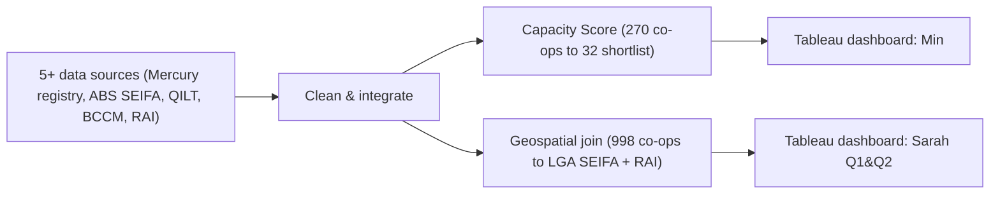

# Australian Co-operatives & Community Need

**Type:** BUSA3021 PACE Business Analytics Project — live client project for **Mercury Co-operative
Limited**, 5-person team, Semester 1 2026
**Role:** I owned the data preparation (Excel) and Tableau dashboard for 2 of the project's 3 stakeholder
personas — **Min** (Employability Manager, Macquarie University) and **Sarah, Q1 & Q2** (Research &
Investment Advisor, Homes NSW). Persona 1 (Peter) and Sarah Q3 were owned by teammates.

> ⚠️ **No Tableau workbook in this folder yet.** The `.twbx` files are large and best shared via
> [Tableau Public](https://public.tableau.com) rather than committed to Git. See "Next steps" below.

## Problem

Mercury Co-operative's existing "Co-op Map" was a static directory. This project expanded it into an
interactive visual exploration tool by combining Mercury's co-op registry with public datasets: ABS SEIFA,
Modified Monash Model, aged-care service data, housing affordability data, and NSW social housing waitlist
data — to answer *where* co-operatives could create the greatest community value.

## Approach

- Cleaned and integrated data from 5+ sources.
- Designed a weighted **Capacity Score** to classify 270 Greater Sydney co-operatives into 3 readiness
  tiers — narrowing an unusable list of 270 into a focused shortlist of 32.
- Performed geospatial joins linking 998 national housing co-operatives to LGA-level ABS SEIFA indices and
  the Rental Affordability Index.
- Built interactive Tableau dashboards for both personas.

## Results

| Metric | Value |
|---|---|
| Greater Sydney co-ops assessed | 270 |
| Placement-ready shortlist | 32 |
| Inclusive co-ops identified | 64 |
| National housing co-ops joined to SEIFA + RAI | 998 |
| Australia's co-op housing share vs. Sweden | 0.05% vs. 24% |
| Co-op vs. startup survival advantage | +20 to +37 pts by sector |

## Files

- `charts/chart_rai_category.png` — housing co-ops by Rental Affordability category
- `charts/chart_capacity_tier.png` — capacity tier distribution (270 → 32 shortlist)

## Next steps (before this looks fully "done")

1. Publish the Persona 2 (Min) and Persona 3 Q1&Q2 (Sarah) dashboards to
   [Tableau Public](https://public.tableau.com) and link them here — a live, clickable dashboard is far
   more impressive to a reviewer than a static screenshot.
2. Once published, add the embed/link at the top of this README and in the Notion case study.

## Full write-up

[Case study on Notion](https://app.notion.com/p/3c2c83dfa32d8177b725c9ca7a073140)
